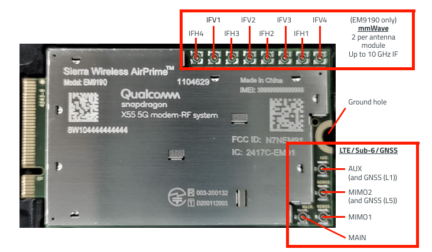
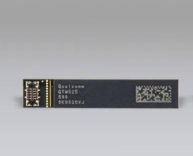
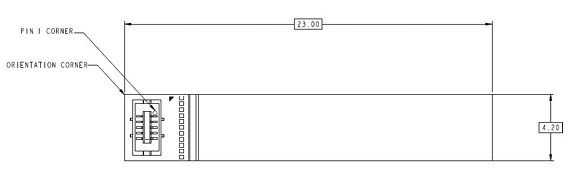
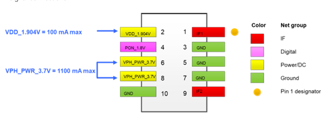
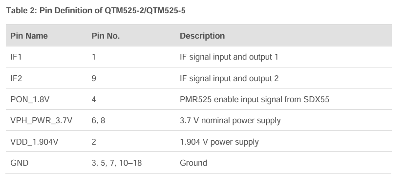
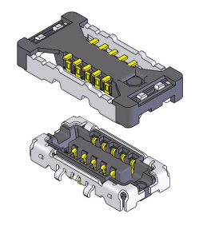
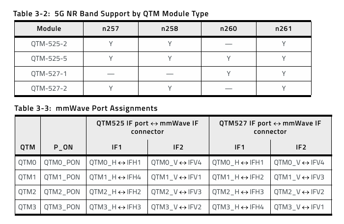

# **Documentation du projet**

  

## **Sommaire**
- Objectif de la documentation
- Le robot Diablo
- Connexion au robot
- Ross
- Bibliographie

## **Objectif de la documentation**

  Dans le cadre de notre projet sur le robot Diablo, nous avons dû faire face à un matériel, un environnement et un langage nouveaux. Les objectifs étant encore loin d'être atteints, 
  nous avons jugé essentiel de créer une documentation solide pour permettre à de futurs étudiants de poursuivre ce travail. Nous avons donc mis un point d'honneur à rédiger une 
  documentation complète, claire et accessible. Une autre difficulté majeure réside dans l’exploitation des mmWaves et la compatibilité des modules 5G avec le robot. Ainsi, cette 
  documentation poursuit un double objectif : faciliter la prise en main du robot et ouvrir la voie à une connexion utilisant les mmWaves.

## **Le robot Diablo**

## **Connexion au robot**

### **Connexion ssh**

### **Connexion VNC**

### **Connexion mmWaves**

Cette partie est juste une agrégation de nos recherches menées sur la connexion en mmWave et comment il serait possible de la mettre en oeuvre. Jamais nous n'avons pu experimenter cette connexion avec du vrai hardware, il est donc possible que la solution présentée ne soit pas fonctionnelle. Cette solution s'appuie sur les manuels officiels que l'on a pu trouver pendant nos recherches et ouvre la voie vers de futurs experimentations.

**Hardware**

  Pour établir une connexion en mmWaves, nous utilisons un modem 5G EM9190 de la marque Sierra Wireless (le manuel de l'EM9190 se trouve dans le dossier "manuel"). 
  Ce module prend en charge plusieurs types de transmission, mais nous nous concentrerons uniquement sur la partie relative à la transmission mmWave.

  A rajouter : caractéristiques et bande de fréquence utilisable par le modem
  
  Le modem dispose de plusieurs types de connecteurs, chacun ayant une utilité spécifique :
  
  

  
  

  
- **1 connecteur M.2** : interface utilisée pour connecter le périphérique à un hôte, comme un ordinateur (voir Annexe 1).
- **4 connecteurs RF MHF4** : dédiés à la transmission via LTE/Sub-6/GNSS, désignés comme suit : MAIN, MIMO1, AUX/GNSS L1, MIMO2/GNSS L5.
- **8 connecteurs MHF7S** : destinés à la transmission via mmWaves, identifiés par les ports suivants : IFH1, IFV1, IFH2, IFV2, IFH3, IFV3, IFH4, IFV4.

Le modem permet de connecter jusqu'à 4 modules d'antennes mmWaves, chaque module étant relié par 2 câbles : l’un à une entrée H (Horizontale) et l’autre à une entrée V (Verticale). Les modules d'antennes compatibles avec le modem EM9190 sont les modèles QTM525 et QTM527, la principale différence résidant dans leur puissance d'émission. L'utilisation de 4 antennes n'est pas obligatoire, notamment avec le module QTM525, mais il est impératif de respecter l’assignation correcte des ports mmWave dans chaque configuration (voir Annexe 1).

Dans le cadre d'une expérimentation simplifiée, nous proposons de commencer avec un seul module QTM525. Par conséquent, cette section se concentrera uniquement sur l’utilisation du module QTM525 (le manuel du QTM525 est lui aussi disponible dans le dossier "manuel").

   

A rajouter : caractéristiques et bande de fréquence utilisable par le module

On peut observer ci-dessus la face avant du module d'antenne QTM525, comprenant le connecteur et ses 10 broches. Pour notre projet, seules 5 broches sont nécessaires :
- Les deux premières broches, IF1 et IF2, seront connectées aux connecteurs IF du modem à l'aide de câbles adaptés.
- Deux autres broches, VPH et VDD, seront utilisées pour l'alimentation.
- Enfin, la broche PON servira à activer un composant du module d'antenne.

   

La connexion des broches est assurée par le module IPEX MPN 20865-010E-01, monté sur le QTM525. Ce module est composé de deux parties, la première est intégrée au QTM525, tandis que la seconde est un élément distinct permettant de fixer les fils sur les broches en s’emboîtant sur la première partie.

  

**Mise en place**

Voici un exemple de mise en place d'un système de transmission en mmWaves sur un ordinateur.

  

Il y a les 4 modules d'antenne et pour chaque module : 
- les deux connecteurs IFV et IFH sont connecté au connecteur IF du modem EM9190 (bleu)
- le premier connecteur pour l'alimentation (VPH) est connecté au 3.7 Volt (rouge)
- le deuxième connecteur pour l'alimentation (VDD) est connecté au modem EM9190 au niveau de la prise M.2 (vert)
- chaque connecteur PON est connecté au modem EM9190 au niveau de la prise M.2 également (rose)

**Problèmes rencontrés**

A rajouter : Connecteurs, comment connecter, prise M.2, commande
  

## **Ross**

## **Annexes**

  

## **Bibliographie**

### **Connexion mmWaves**

Manuel de l'EM9190 : \
https://manuals.plus/sierra-wireless/airprime-em9190-5g-module-manual \
Manuel technique de l'EM9190, pdf : \
https://source.sierrawireless.com/resources/airprime/minicard/airprime_em919x-7690_product_technical_specification/#sthash.pqpB43GY.dpbs

