# **Connexion au robot**

  

## **Sommaire**

- [Connexion SSH](#Connexion-SSH)
- [Connexion VNC](#Connexion-VNC)
- [Connexion mmWaves](#Connexion-mmWaves)
- [Annexes](#Annexes)
- [Bibliographie](#Bibliographie)

## **Connexion SSH**

## **Connexion VNC**

## **Connexion mmWaves**

Cette partie est juste une agrégation de nos recherches menées sur la connexion en mmWave et comment il serait possible de la mettre en oeuvre. Jamais nous n'avons pu experimenter cette connexion avec du vrai hardware, il est donc possible que la solution présentée ne soit pas fonctionnelle. Cette solution s'appuie sur les manuels officiels que l'on a pu trouver pendant nos recherches et ouvre la voie vers de futurs experimentations.

### **Modem EM9190**

  Pour établir une connexion en mmWaves, nous utilisons un modem 5G EM9190 de la marque Sierra Wireless (le manuel de l'EM9190 se trouve dans le dossier "manuels"). 
  Ce module prend en charge plusieurs types de transmission, mais nous nous concentrerons uniquement sur la partie relative à la transmission mmWave.

Le tableau ci-dessous répertorie les bandes de fréquences prises en charge par le module Sierra Wireless. Pour une transmission mmWave, les bandes prises en charges sont n257, n258, n260 et n261. On a également les   capacités DL(reception)/UL(émission).

  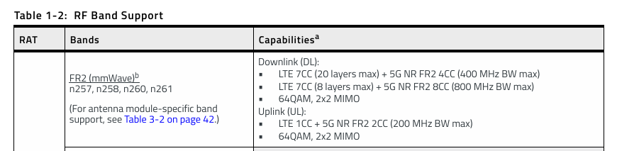

Voici les caractéristiques de chaque bande à notre disposition :

n257 : Fréquence : 26,5 GHz – 29,5 GHz.

n258 : Fréquence : 24,25 GHz – 27,5 GHz.

n260 : Fréquence : 37 GHz – 40 GHz.

n261 : Fréquence : 27,5 GHz – 28,35 GHz.

Ces bandes sont particulièrement adaptées aux déploiements en milieu urbain dense et aux scénarios exigeant des débits élevés, tels que les environnements industriels ou les stades. Cependant, notre projet se concentre spécifiquement sur l'utilisation de la bande des 26 GHz, correspondant à la bande **n258**.

  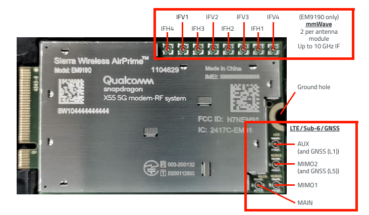

  
Le modem dispose de plusieurs types de connecteurs, chacun ayant une utilité spécifique :
  
- **1 connecteur M.2** : interface utilisée pour connecter le périphérique à un hôte, comme un ordinateur (voir Annexe 1).
- **4 connecteurs RF MHF4** : dédiés à la transmission via LTE/Sub-6/GNSS, désignés comme suit : MAIN, MIMO1, AUX/GNSS L1, MIMO2/GNSS L5.
- **8 connecteurs MHF7S** : destinés à la transmission via mmWaves, identifiés par les ports suivants : IFH1, IFV1, IFH2, IFV2, IFH3, IFV3, IFH4, IFV4.

### **Module d'antenne QTM525**

Le modem permet de connecter jusqu'à 4 modules d'antennes mmWaves, chaque module étant relié par 2 câbles : l’un à une entrée IFH (Horizontale) et l’autre à une entrée IFV (Verticale). Les modules d'antennes compatibles avec le modem EM9190 sont les modèles QTM525 et QTM527, la principale différence résidant dans leur puissance d'émission. L'utilisation de 4 antennes n'est pas obligatoire, notamment avec le module QTM525, mais il est impératif de respecter l’assignation correcte des ports mmWave dans chaque configuration (voir Annexe 1).

Dans le cadre d'une expérimentation simplifiée, nous proposons de commencer avec un seul module QTM525. Par conséquent, cette section se concentrera uniquement sur l’utilisation du module QTM525 (le manuel du QTM525 est lui aussi disponible dans le dossier "manuels").

  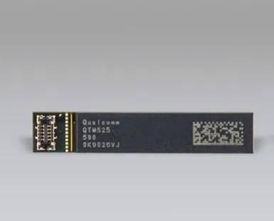 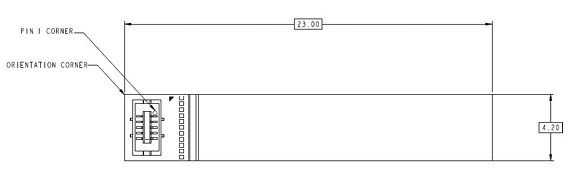

Il existe deux variantes, QTM525-2 et QTM525-5, mais ça n'a peut d'incidence car les deux peuvent oppérer sur la bande n258 (pour plus de caractéristiques sur le module d'antenne voir Annexe 2).

On peut observer ci-dessus la face avant du module d'antenne QTM525, comprenant le connecteur et ses 10 broches. Pour notre projet, seules 5 broches sont nécessaires :
- Les deux premières broches, IF1 et IF2, seront connectées aux connecteurs IF du modem à l'aide de câbles adaptés.
- Deux autres broches, VPH et VDD, seront utilisées pour l'alimentation.
- Enfin, la broche PON servira à activer un composant du module d'antenne.

  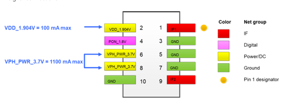 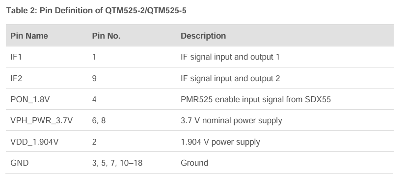

La connexion des broches est assurée par le module IPEX MPN 20865-010E-01, monté sur le QTM525. Ce module est composé de deux parties, la première est intégrée au QTM525, tandis que la seconde est un élément distinct permettant de fixer les fils sur les broches en s’emboîtant sur la première partie (les manuels du module sont disponibles dans le dossier "manuels").

  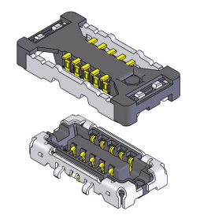

### **Mise en place**

Voici la mise en place d'un système de transmission en mmWaves avec le module EM9190.

  

- Les connecteurs coaxials IFV et IFH sont reliés au connecteur IF du modem EM9190.
- Le premier connecteur d'alimentation VDC power est raccordé à une tension de 3,7 volts.
- Le deuxième connecteur d'alimentation QTM_IO_1.9V est connecté au modem EM9190, au niveau du port M.2 (en vert).
- Chaque connecteur QTMx_PON est également relié au modem EM9190, au niveau du port M.2 (en rose).

### **Difficultés rencontrées**

Maintenant que nous savons comment tout mettre en place, il faut trouver le hardware compatible, c'est justement cela qui nous a posé de trop grandes difficultés.

#### **Connexion à l'hôte**

La connexion à l'hôte se réalise via un connecteur M.2, ce connecteur est couramment utilisé dans les ordinateurs modernes pour connecter des composants tels que des disques SSD, des cartes réseau sans fil et d'autres périphériques d'extension. La carte réseau EM9190 utilise un connecteur **M.2 3042-S3 Type B** spécéfique aux modules **WWAN** et supporte les interfaces **PCIe et USB3**.

Ainsi, pour intégrer l'EM9190 avec un ordinateur ou une carte Raspberry, il est nécessaire d'avoir un port M.2 Type B, compatible avec les interfaces PCIe ou USB et compatible également avec une utilisation réseau WWAN.

Lors de nos recherches pour trouver une carte d'extension compatible avec le Raspberry Pi 4B, **nous n'avons pas trouvé de modèles compatibles**. Malgré tout, nous avons quelques pistes.

La première piste est le manuel **dev kit de Sierra Wireless** (disponible dans le dossier "manuels). Mais le manuel ne fait pas mention des modules d'antennes spécifiques à l'utilisation des mmWaves. Il reste alors encore la question de savoir comment alimenter l'antenne en 3.7V et comment connecter les broches QTM_PON et QTM_IO_1.9V au connecteur M.2.

Il existe aussi des adaptateurs **M.2 Type B vers USB3**, spécifique pour la transmition 3G/4G/5G, mais il reste encore la même question de l'alimentation et de la connection des broches. Voici le lien vers l'adaptateur : https://www.newegg.com/p/3C6-01NE-000M2

#### **Connecteurs MHF7S**

## **Annexes**

### **Annexe 1**

  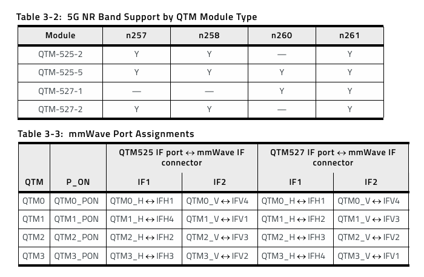

### **Annexe 2**

  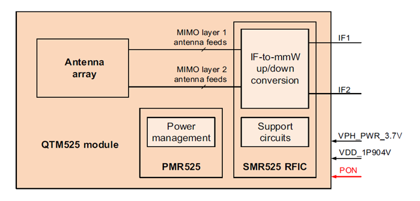

  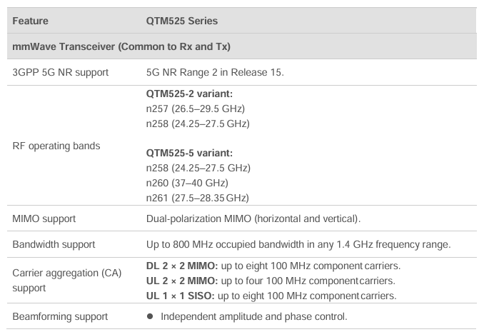

  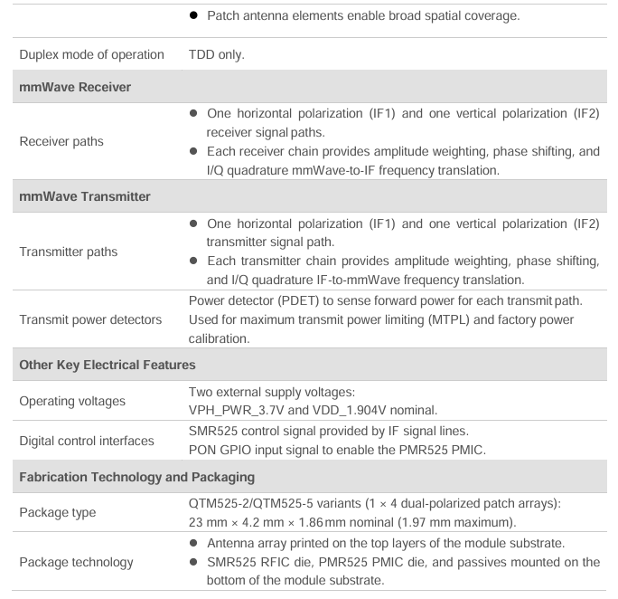

## **Bibliographie**

### **Connexion mmWaves**

SIte du manuel de l'EM9190 : \
https://manuals.plus/sierra-wireless/airprime-em9190-5g-module-manual \

Site de sierra-wireless : \
https://source.sierrawireless.com/devices/em-series/em9190/#sthash.LF0QUKzM.eMAEwvXY.dpbs

